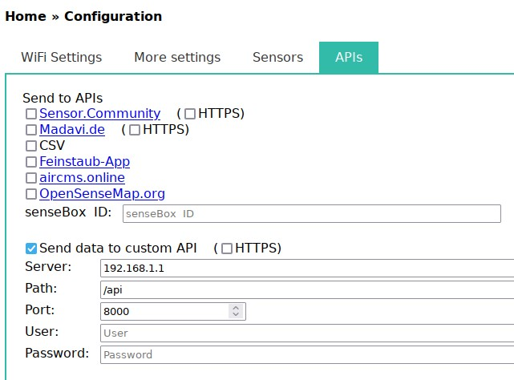
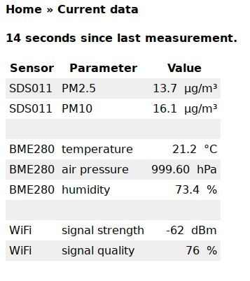
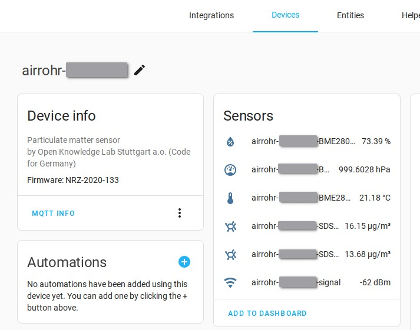

# Airrohr-mqtt
Airrohr-mqtt is a Homeassistant compatible mqtt bridge for the
[Airrohr](https://github.com/Naesstrom/Airrohr-kit). It sets up a
webserver that takes requests from the Airrohr and converts them
into MQTT messages.

## Supported Features

### Homeassistant features

 - Device advertisement via MQTT
 - Updating sensor values via MQTT
 - Configurable sensor properties

### Sensors

 - SDS011 (`pm10`, `pm25`)
 - BME280 (`temperature`, `humidity`, `pressure`)

## Building

Cargo brings most of the dependencies, however some libraries depend on
native C libraries. On Debian based systems the following packages
are required:

 - `cmake`
 - `libssl-dev`
 - `pkg-config`

## Configuration

### Webserver

The webserver is based on [Rocket](https://rocket.rs/) so it supports any
environment variables supported by Rocket. It will take the `POST` requests
generated by the Airrohr under the `/api` path.

**Attention**: The webserver does not support any authentication. Only make it
accessible in trusted environments. Otherwise anyone is able to write any
data into Homeassistant.

### Settings

The server looks for a `Settings.toml` file in the local directory. This file
contains the following keys:

 - `server`: MQTT server
 - `user`: MQTT username
 - `password`: MQTT password
 - `sensors`: [Sensors](#sensors) configuration file

An example configuration can be found in [`Settings.toml.def`](Settings.toml.def).

### Sensors

The sensors are configured in [`sensors.json`](sensors.json). It is a map of Airrohr
sensors to Homeassistant sensors with additional information. E.g. the Airrohr sensor value
```json
{"value_type": "BME280_temperature", "value": "23.50"}
```
will be transformed into a sensor configuration for Homeassistant to properly interpret the
value received via MQTT:
```json
{"BME280_temperature": {"class": "temperature", "unit": "°C", "value_template": "{{ value }}"}}
```
Additional sensors or different units can be configured without recompilation.

### Airrohr

To configure your Airrohr enter the IP, domain and path into the custom API part of the API
configuration. The path should end on `/api` but can also have a prefix if you're using a
reverse proxy.



## Running

To run the server just provide a `Settings.toml` file and run
```shell
$ cargo run
```
By default it will listen to `localhost:8000`.

## MQTT Integration

The bridge publishes a device per Airrohr with all of its sensors with the following topics:
```
homeassistant/sensor/airrohr-12345678/<sensor name>/config
```
The configuration will include the topic for the value of each sensor. They look as follows:
```
airrohr/airrohr-12345678/<sensor name>
```




